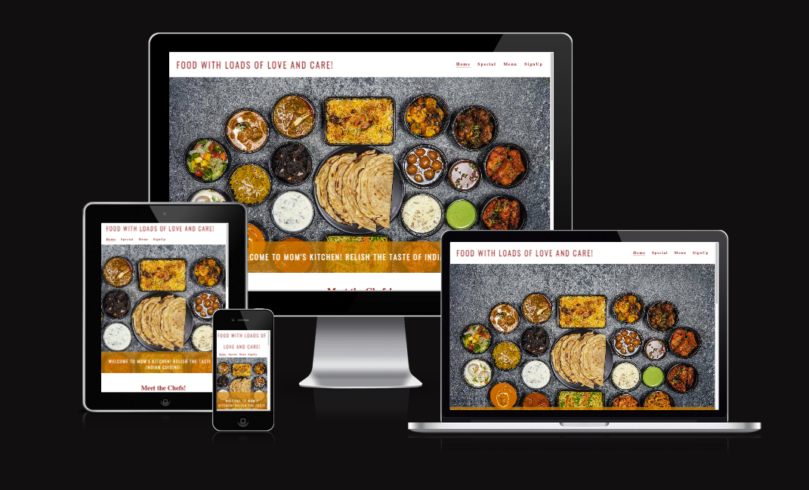
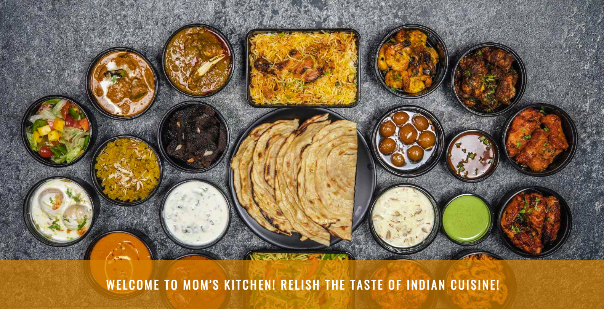
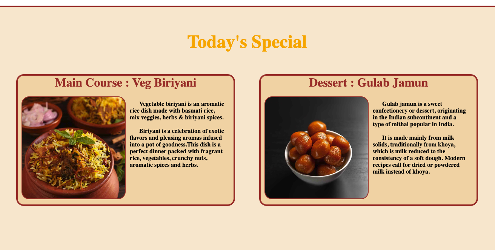
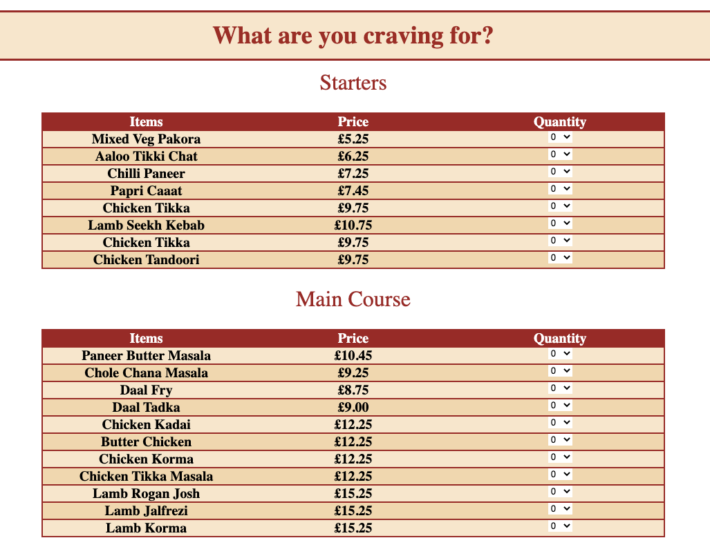
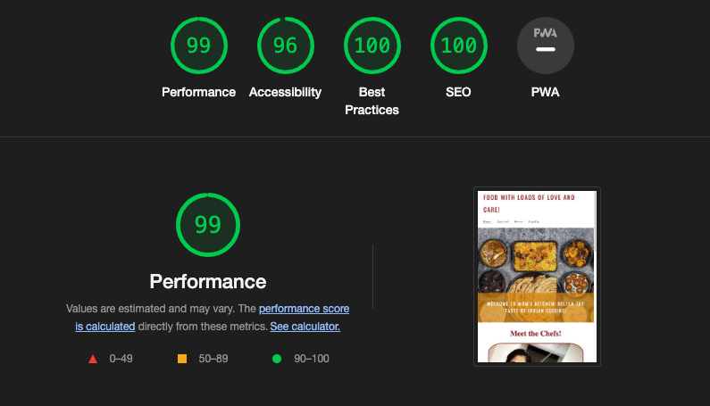

# Mom's Kitchen

## Relish The taste of Indian cuisine

This website is an Indian food ordering website, it introduces visitors to the the mother- daughter duo who are the chefs behind all the dishes available on the website. The site enables visitors to know about chefs , special dish for the day and allows them to order food of their choice from the menu available. It talks about discount and allows customer to sign-up to avail this discount.

[Click here to view website](https://abhilashaynipully.github.io/moms-kitchen)

## Contents

- [Introduction](#moms-kitchen)
- [User Experience (UX)](#user-experience-ux)        
- [User Experience Design (UXD)](#user-experience-design-uxd)
- [Features](#features)
- [Testing](#testing)
- [Deployment](#deployment)
- [Credits](#credits)

## User Experience (UX)

   ### User Stories

####  As a New Visitor:
- Visitor would want to understand the purpose of the site from home page onwards.
- Visitor would want to be able to easily navigate through the website and quickly able to locate the content he/she is looking for.
- Visitor would want to know the credibility by way of feedbacks and responses by previous users.
- Visitor would like to find social media links of the author to know more.

####  As a Returning Visitor:
- Visitor would like to navigate to required information without any constraints.
- Visitor would like to signin and proceed in order to avoid filling in all the details while ordering again.
- Visitor would want to navigate to social media links to provide feedback.

## User Experience Design (UXD)
The 5 planes of User Experience Design were taken into serious consideration while designing the website, so that all the possible user stories can be dealth wit.
Lets look at them in details basis each plane.

### Strategy Plane
- Content is designed for anyone who is interesed in trying out Indian cuisine hence is culturally appropriate.
- All content on the website is aimed at providing information towards the subject matter and hence is relevant.
- Website has information in form of text , tables and images making it convenient and pleasent to use for users, hence has appropriate technology incorporation.
- Website provides information about chefs and promotes homely food which makes it stand out among regular food ordering websites.
- Website is open to all and will cater to different people using different platforms and hence is responsive.

### Scope Plane
- User of website would know about the Indian cuisine and chefs and various options available to order.
- User can navigate through website and understand everything as the website is self explanatory.
- Website only incorporates HTML and CSS technologies and hence functionality is limited upto certain extend.

### Structure Plane
#### Landing Page
- Nav bar with links to Special page, Menu Page and Signup Page.
- Hero image (Indian Dishes) with cover text. 
- Introduction to chefs and about their background.
- Testimonials of previous customers.
- Details and link of discount thats available on signup.
- Footer with social media links.
#### Special Page
- Nav bar with links to Special page, Menu Page and Signup Page.
- Today's special section which talks about 2 special dishes.
- Special section has images and brief description about the dishes of the day.
- Link to main menu if user wants to check out all dishes.
- Footer with social media links.
#### Menu Page
- Nav bar with links to Special page, Menu Page and Signup Page.
- Detailed menu with all dishes and option to choose the quantity.
- List is exhaustive separated into different tables based on type of food.
- Button to place order. (Currently not funtional due to limited technology use, HTML & CSS).
- Footer with social media links.
#### Signup Page
- Nav bar with links to Special page, Menu Page and Signup Page.
- Signup box for users to fill in details and signup.
- Link for login terminal for existing users to login.
- Footer with social media links.

 ### Skeleton Plane
 Basis the structure plane a blueprint for the site was created. Wireframes for three different platforms were created to display responsiveness of the website.
 1. Desktop
 2. Tablet
 3. Mobile

The wireframes were made with the help of Balsamiq.
[Click here to view wireframes]()

### Surface Plane 
Every attempt was made to ensure that the website appears appealing to the visitors. This required taking care of aspects like

#### 1. Color
Shades of Orange and Brown colors were considered for the website as these colors represent the spices and herbs of Indian Cuisine.

#### 2. Typography
For logo regular font of Oswald was used which was imported from Google Fonts.

For headings (h2 onwards) and paragraph Times was used considering improved readability.

#### 3. Imagery
Hero image : The image of Indian dishes was sourced from pexels.com contributed by Anil Sharma.
Chefs : The image of both chefs was taken by me.
Main Course : The image of Vegetable Biriyani was sourced from pexels.com contributed by Saveurs Secretes.
Dessert : The image of Gulab Jamun was sourced from pexels.com contributed by Zenith Photographics.

#### 4. Iconography
For social media links in footer icons were used and were sourced from Font Awesome.

## Features

### Navigation Bar
  - The navigation bar is available on all pages and consumes small portion of viewport so that much of the contents is not covered.

  

  - As the screen width decreases the links to other pages comes below the website logo.

    

  - An underline is present below the active link on the navigation menu.
  - On hover the links in navigation menu change color to orange from default brown and the font size increases.

### Hero Image
  - The hero image and cover text appears with an animation grabbing the users attention while landing on the home page.
  - The cover text conveys the name of the website and tells user about the focus area of the website.

   

### Chefs Section
  - The chefs section introduces the mother-daughter duo who are the chefs prearing the food.

   

### Todays Special 
  - The Today's Special section shows pictures and details of the special dishes of the day.
  - The special items appear with an animation grabbing users attention towards it.

  

### Menu
  - The Menus are divided into separate table for ease of understanding for the user.

  

## Testing

  - The site has been tested on multiple browsers and devices.

  - It can be confirmed that the website works and is responsive accross devices as some of my friends and family tried using the website.

  - All contents on the website are readble and easy to understand.

  - All the forms require users to fill in the details to proceed, however buttons are not functional yet due to limitation of technology to HTML and CSS only.

## Validator Testing

  - For HTML no errors were found on the official validator.w3.org site.

  - For CSS no errors were found on the official jigsaw.w3.org site.  

  - Lighthouse test was conducted on Google Chrome to check site performance and following results were obtained. 

   

## Bug Fixes

   - No unfixed bugs

## Deployment

   - The site was deployed using GitHub pages using following steps.

     1. In GitHub repository navigate to the settings tav.
     2. Scroll down and select Pages from the left side navigation menu to open GitHub pages.
     3. In the source select deploy from branch and under branch select main.
     4. after selecting from main click on save and refresh the message appears stating 'Your site is live at https://abhilashaynipully.github.io/moms-kitchen/'

## Credits
### Mentor
Thank you Mr Anthony Ugwu for being a great mentor, I couldn't have asked for a better mentor. He guided me through this projects with his feedback and suggestions. Showed me the right path to complete my first project successfully.

 ### Content
- Written content for the Chefs was contributed by my wife who the the daughter chef.
- Written content for the dessert gulab jamun under special was obtained from wikipedia.
- Written content for the vegetable biriyani was obtained from the website www.indianhealthyrecipes.com.
 
 ### Media
 - All Images were obtained from pexels.com except the chef's images which was taken by me.

 ### Code
 - All code was written by me.
 - Inspiration for the footer was taken from the love running project of www.codeinstitute.net.

  
  
